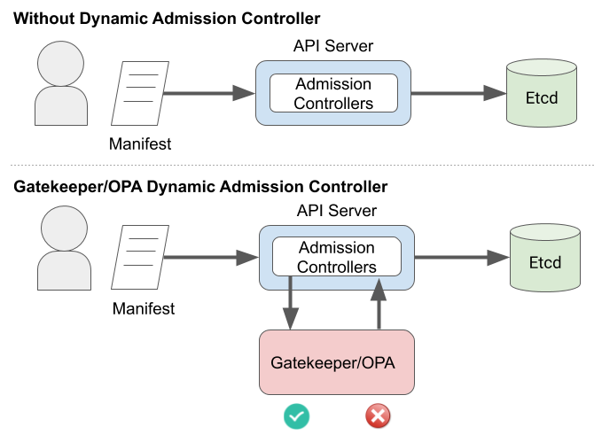

# Persistence: Scenario 2 Defense

## Backstory

### Name: __Blue__

* Still overworked
* Still can only do the bare minimum
* Uses the defaults when configuring systems
* Usually gets blamed for stability or security issues

### Motivations

* A week after the first incident, __Blue__ gets paged at 3am because “website is slow again”.
* __Blue__, puzzled, takes another look.
* __Blue__ decides to dust-off the résumé “just in case”.

## Defense

__Blue__ is paged again with the same message as last time. What is going on? Could this be the same problem again?

### Identifying the Issue

Let's run some basic checks again to see if we can find random workloads:

```console
kubectl get pods --all-namespaces
```

There does not appear to be any unusual workloads running on our cluster.

Just to be sure, let's check our cluster's resource consumption:

```console
kubectl top node
```

and

```console
kubectl top pod --all-namespaces
```

So far, everything looks normal. What gives?

Remembering that `falco` was deployed for runtime visibility and monitoring last time, we seem to be getting alerts from StackDriver filters.

In a new <a href="https://console.cloud.google.com/logs/viewer" target="_blank">StackDriver window</a>, let's run the query:

```console
resource.type="container"
resource.labels.container_name:"falco"
jsonPayload.rule="Launch Privileged Container" OR jsonPayload.rule="Terminal shell in container"
```

We're looking for `container` logs from `falco` where triggered rules are privileged containers or interactive shells.

Huh. This is definitely odd. What is this privileged `alpine` container?

In a new <a href="https://console.cloud.google.com/logs/viewer" target="_blank">StackDriver window</a>, let's correlate this with kubernetes cluster logs:

```console
resource.type=k8s_cluster
protoPayload.request.spec.containers.image="alpine"
```

So, we see a few things:

1. References to `dev` namespace and serviceaccount `system:serviceaccount:dev:default`
1. A pod named `r00t` got created
1. The pod command is `nsenter --mount=/proc/1/ns/mnt -- /bin/bash`
1. The `securityContext` is `privileged: true`
1. The `hostPID` is set to `true`

This is not looking good. Can we see any activity in this container?

In a new <a href="https://console.cloud.google.com/logs/viewer" target="_blank">StackDriver window</a>, let's search for this `r00t` container logs:

```console
resource.type="container"
resource.labels.pod_id:r00t
```

Wow. We are seeing some commands executed from the container.

But wait, looks like they're directly on the node.

They tried to create a pod, but failed. So, they created a Service and an Endpoint.

In cloud shell, let's see if those exist:

```console
kubectl -n kube-system get svc,ep
```

That's one sneaky hacker, creating services and endpoints under the guise of Istio!
But, jokes on them, I'm not using a service mesh.

Let's delete that service (the endpoint will be deleted too):

```console
kubectl -n kube-system delete svc/istio-mgmt
```

But, how did this happen?!?!?! What is in `dev` namespace that led to someone running commands on the nodes?

```console
kubectl -n dev get pods
```

```console
kubectl -n dev logs $(kubectl -n dev get pods -o name | grep dashboard) -c dashboard
```

Nothing.

```console
kubectl -n dev logs $(kubectl -n dev get pods -o name | grep dashboard) -c authproxy
```

Ah, so this is how they got in. There is `/webshell` activity in authproxy logs with the source IP.

But, how can we mitigate ourselves from this in the future?

Remember that the attacker elevated their privileges by running a privileged container and I remember a talk at KubeCon San Diego 2019 about Open-Policy-Agent/Gatekeeper that can be deployed as an admission controller.

That should work because an admission controller is a piece of code that intercepts requests to the Kubernetes API server after the request is authenticated and authorized.



So, let's block privileged containers and whitelist only the images we expect to have on our cluster:

```console
kubectl apply -f https://raw.githubusercontent.com/securekubernetes/securekubernetes/master/manifests/security2.yaml
sleep 10
kubectl apply -f https://raw.githubusercontent.com/securekubernetes/securekubernetes/master/manifests/security2-policies.yaml
```

Let's see if this actually works:

```console
kubectl -n dev run alpine --image=alpine --restart=Never
```

```console
cat <<EOF >priv-pod.yaml
apiVersion: v1
kind: Pod
metadata:
  name: privileged-pod
spec:
  containers:
  - name: ubuntu
    image: ubuntu
    stdin: true
    securityContext:
      privileged: true
EOF
```

```console
kubectl -n dev apply -f priv-pod.yaml
```

It works!

I should call the boss about this incident.
